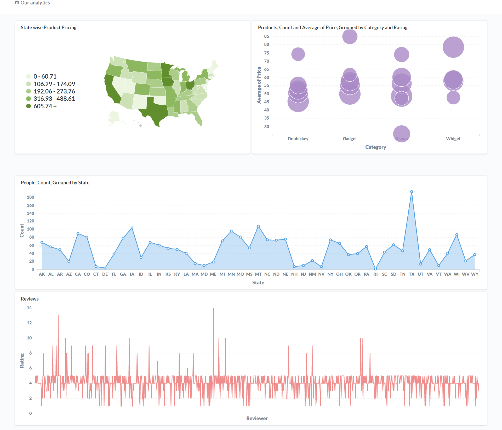
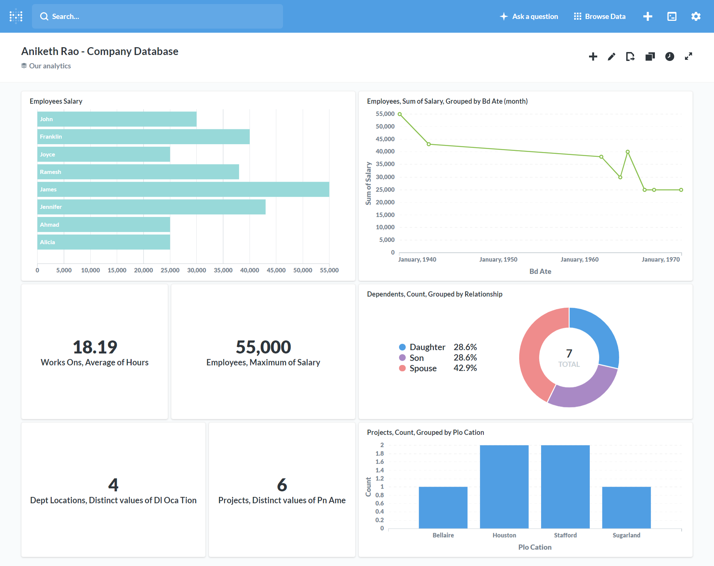

## Movie Management System 
### Built using Metabase Business Intelligence Tool, Google Big Query & Google Data Studio

### Tools used  
- Software: 
  - Metabase https://www.metabase.com/
  - Google Big Query https://cloud.google.com/bigquery

### Outcomes

- Exploration & Data analysis of Sample Dataset on Metabase
- Importing a database into Metabase and performing data analysis on the same
- Access the Google Big Query Dashboard
- Running queries on large sample databases included in Big Query
- Plotting data on Google Data Studio

### Procedure 
- Exploring the Metabase dashboard, running SQL queries and Understanding the Metabase
- Used different functions in the metabase and result was shown on the dashboard
- Importing a database into Metabase and performing data analysis on the same
- Used Google big query's sample dataset, and output was shown on the Google big query as well as graphs were created using Google data studio

### Output
-  Explorations & Data analysis of Sample Dataset on Metabase

- Explorations & Data analysis of Dataset

 

- Running SQL queries Google Big Query's sample dataset

 .png)

 .png)

 .png)

 .png)

- Plotting graphs & charts on Google Data Studio

 .png)

